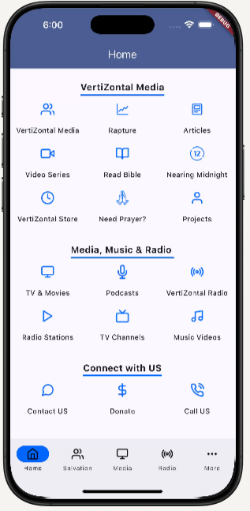
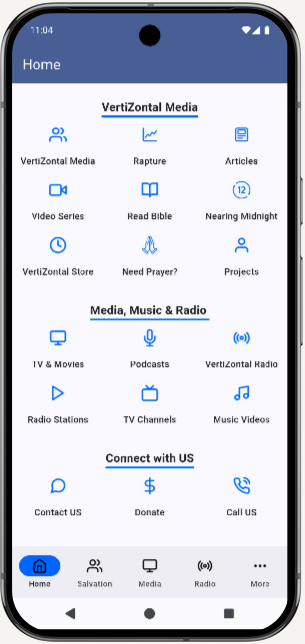

# VertiZontal Media

VertiZontal Media is a music media platform. We provide some of the best in Christian Music from the past and today. Listen to artists like Brook Fraser, Paul Clark, Danny Gokey, Chris Tomlin and much more.

 

 

## :book: Features

* Firebase Push Notifications
* Firebase In-App Messasing
* UI (Layout + Content + Images) Generated using CMS
* UI Cached in case of Network Failure.
* In App Reviews
* Cross Platform (IOS and Android)

## :warning: Requirements

* Android 5.0+
* IOS 13.0+

## :camera: Screenshots

## :hammer: Contributors

